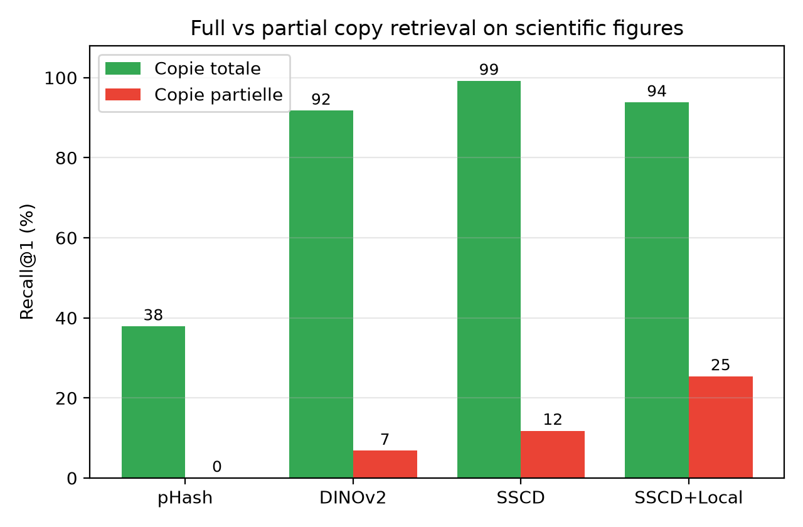

# Do Copy-Detection Descriptors Transfer to Scientific Figures?
### A Reproducible Benchmark for Full and Partial Figure Reuse

Open benchmark and code for evaluating image **copy-detection** on **scientific figures**, with an explicit **full-copy vs. partial-copy** split. Built on top of the public [BioFors](https://github.com/vimal-isi-edu/BioFors) dataset (CC0).

> **TL;DR** — State-of-the-art copy-detection descriptors (SSCD, DINOv2) transfer very well to *full* copies of scientific figures, but **all global descriptors collapse on partial copies** (a single panel reused inside a composite — the dominant fraud pattern). A local SIFT+RANSAC re-ranking stage more than doubles partial-copy recall.

---

## Key results (recall@1, %)

| | pHash | DINOv2 | SSCD | SSCD+Local |
|---|:---:|:---:|:---:|:---:|
| **Full copy** | 37.9 | 91.8 | **99.2** | 93.8 |
| **Partial copy** | 0.0 | 6.8 | 11.8 | **25.4** |
| Blot/Gel | 33.6 | 77.0 | 89.7 | 86.0 |
| Microscopy | 33.7 | 87.6 | 89.2 | 86.4 |

<p align="center"></p>

---

## What this benchmark is

We do **not** redistribute BioFors. This repository is the **reproducible layer on top of it**:
- a deterministic **query generator** (500 source panels × 9 variants = 4,500 queries; 8 full-copy transforms + 1 partial-copy composite; `seed = 42`);
- the **ground truth** (`data/benchmark_full/ground_truth.json`);
- the full **evaluation pipeline** (embedding, FAISS retrieval, metrics, local re-ranking).

Anyone can download public BioFors and run the scripts to regenerate the exact same queries and numbers.

## Repository structure

```
code/
  01_download_biofors.py     # download BioFors (Google Drive, CC0)
  02_inspect_dataset.py      # extract + inspect the dataset
  03_build_queries.py        # generate 4,500 query variants (--full)
  04_extract_embeddings.py   # encode corpus/queries (phash|dinov2|sscd)
  05_search_evaluate.py      # FAISS retrieval + metrics
  06_make_figures.py         # master table + figures
  07_local_rerank.py         # SSCD top-100 -> SIFT+RANSAC re-ranking
data/
  results/                   # per-method CSVs + MASTER table
  figures/                   # figures used in the paper
  benchmark_full/ground_truth.json
```

## Reproduce in a few steps

```bash
# 1. Install PyTorch for your GPU (example for NVIDIA Blackwell / cu128):
pip install torch==2.10.0+cu128 torchvision==0.25.0+cu128 --index-url https://download.pytorch.org/whl/cu128
pip install -r requirements.txt

# 2. Get BioFors (images, CC0) + modality labels
python code/01_download_biofors.py
python code/02_inspect_dataset.py
curl -L -o data/classification.json https://raw.githubusercontent.com/vimal-isi-edu/BioFors/main/annotation_files/classification.json

# 3. Build the benchmark (4,500 queries, seed 42)
python code/03_build_queries.py --full

# 4. Encode + evaluate each method
python code/04_extract_embeddings.py --method sscd --set corpus
python code/04_extract_embeddings.py --method sscd --set queries
python code/05_search_evaluate.py --method sscd
#   (repeat with --method phash and --method dinov2)

# 5. Local re-ranking (optional, ~30-45 min) + figures
python code/07_local_rerank.py
python code/06_make_figures.py
```

SSCD weights (TorchScript, ~94 MB) are downloaded separately from the official source:
```bash
curl -L -o models/sscd_disc_mixup.torchscript.pt https://dl.fbaipublicfiles.com/sscd-copy-detection/sscd_disc_mixup.torchscript.pt
```

## Data & licenses

- **BioFors** (base images, 47,805 panels, CC0) — Sabir et al., *BioFors: A Large Biomedical Image Forensics Dataset*, ICCV 2021. Not redistributed here; downloaded via `code/01`.
- **This repository** (benchmark generator, ground truth, evaluation code) — MIT License (see `LICENSE`).

## Citation

```bibtex
@inproceedings{elfallah2026scifigcopy,
  title     = {Do Copy-Detection Descriptors Transfer to Scientific Figures?
               A Reproducible Benchmark for Full and Partial Figure Reuse},
  author    = {El Fallah, Ayoub and others},
  year      = {2026}
}
```

## Acknowledgements

Built on the BioFors dataset. Models used: SSCD (Meta AI), DINOv2 (Meta AI), FAISS.
